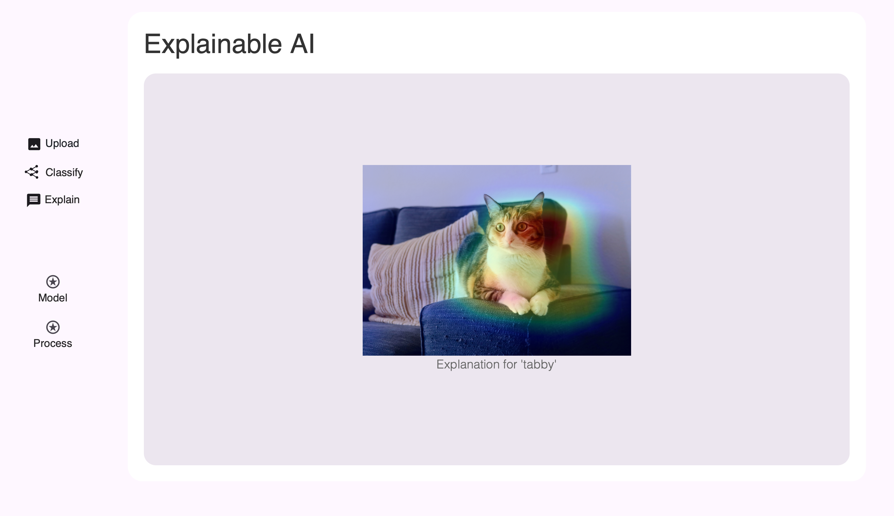

# Visual Explainable AI


Grad-CAM Explanation for EfficientNetV2's 'Tabby (Cat)' Classification

## Introduction

Visual Explainable AI was a project developed by Germain Girndt, Katharina Krier and Antonio Metz for making the decision-making processes of AI models transparent and understandable through visual explanations.

The design decisions are documented in the file `2026-03-30 - Projektarbeit – schriftliche Ausarbeitung.pdf` (German only).


## Project Setup

For setting up the project on your machine, execute the following 5 steps:

#### 1. Ensure Python version is 3.10.14:

```
python --version
```

#### 2. Create a Virtual Environment:

```
python -m venv venv
```

#### 3. Execute the Virtual Environment:

```
source venv/bin/activate # Example for MacOS/Linux
venv\Scripts\activate # Example for Windows
```

#### 4. Install the required libraries

```
pip install -r requirements.txt
```

#### 5. Create a new .env file according to the template

```
cp .env.example .env
```

## Running the App

For running the App at http://127.0.0.1:8000, we call the fastapi CLI, passing in our root file.

#### In project root folder ('visual_explainable_ai'), run the following command:

```
fastapi dev src/app/main.py
```

## Further Notes

### In case of Pytorch incompatibilities:

The install command for Pytorch may be different depending on the user machine. If there's any incompatibility, check the following website:
https://pytorch.org/get-started/locally/

### Rendering the Mermaid Documentation Diagrams

The documentation diagrams are in the `./documentation` folder. To render them on your browser, use the `https://mermaid.live` website.

Alternatively, to render them on VSCode install the following Markdown plugins and opening the diagrams as a Markdown file:

```
# Markdown Syntax Highlightning
bpruitt-goddard.mermaid-markdown-syntax-highlighting

# Markdown Previewer 1
hd101wyy.markdown-preview-enhanced

# Markdown Previewer 2 (Alternative)
yzhang.markdown-all-in-one

# Mermaid for Markdown (for generating the Mermaid Diagrams)
bierner.markdown-mermaid
```

### Project Management Trello-Board

The Trello-Board for the project with the Trello Cards can be found in (access required):

https://trello.com/b/51PYbgcp/xai-projektarbeit-master

### Figma Prototype

The Figma-Prototype can be found in (access required):

https://www.figma.com/design/9V11JkjmbXjMg4URsNOcdb/Explainable-AI-App?node-id=0-1&t=65zz7mwVtSEh9lhl-1
