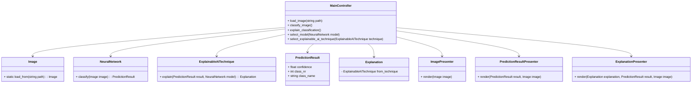

### Class Diagram – MVC

```mermaid
classDiagram

%% --------------------
%% Model Layer
%% --------------------
class Image {
    + static load_from(string path): Image
}

class PredictionResult {
    + float confidence
    + int class_nr
    + string class_name
}

class NeuralNetwork {
    + classify(Image image): PredictionResult
}

class ExplainableAITechnique {
    + explain(PredictionResult result, NeuralNetwork model): Explanation
}

class Explanation {
    - ExplainableAITechnique from_technique
}

%% --------------------
%% View Layer
%% --------------------
class ImagePresenter {
    + render(Image image)
}

class PredictionResultPresenter {
    + render(PredictionResult result, Image image)
}

class ExplanationPresenter {
    + render(Explanation explanation, PredictionResult result, Image image)
}

%% --------------------
%% Controller Layer
%% --------------------
class MainController {
    + load_image(string path)
    + classify_image()
    + explain_classification()
    + select_model(NeuralNetwork model)
    + select_explainable_ai_technique(ExplainableAITechnique technique)
}

%% --------------------
%% Relationships
%% --------------------
MainController --> Image
MainController --> NeuralNetwork
MainController --> ExplainableAITechnique
MainController --> PredictionResult
MainController --> Explanation

MainController --> ImagePresenter
MainController --> PredictionResultPresenter
MainController --> ExplanationPresenter

```
