# Static and Dynamic Models

## Architectural Decision: Model-View-Controller (MVC)

### Context

The Explainable AI (xAI) Teaching App must:

1. Load and visualize images.
2. Classify them using a neural network model.
3. Generate an explanation utilizing a xAI technique.
4. Be maintainable, extensible, and easy to demonstrate live in a classroom.

### Why MVC

The MVC Architecture fulfill these requirements by providing a clear separation between:

- AI + Computation logic (Model)
- Graphic Visualization/Presentation logic (View)
- User Interaction (Controller)

Here is important to highlight that MVC architecture was mainly chosen to fulfill the maintainability and extensibility criteria, while maintaining a flexible and lightweight architecture.

#### ✅ Advantages of MVC

- Separation of concerns: Isolates computation, logic, and UI for easier maintenance.
- Extensibility: New models or xAI methods can be added by extending the model layer.
- Testability: Model and controller can be unit-tested independently from the view.
- Pedagogical clarity: Mirrors conceptual separation between data, processing, and presentation, useful in an educational setting.

#### ⚠️ Disadvantages of MVC

- Slightly more boilerplate code (e.g., additional classes for presenters and controllers).
- Requires disciplined coordination between components to avoid “fat controllers.”

### Static Model

#### Class Diagram: Coordination through the Controller Class

```mermaid
classDiagram

%% --------------------
%% Model Layer
%% --------------------
class Image {
    + static load_from(string path): Image
}

class Prediction {
    + float confidence
    + int class_nr
    + string class_name
}

class NeuralNetwork {
    + classify(Image image): Prediction
}

class ExplainableAITechnique {
    + explain(Prediction prediction, NeuralNetwork for_model): Explanation
}

class Explanation {
    - ExplainableAITechnique from_technique
}

%% --------------------
%% View Layer
%% --------------------
class ImagePresenter {
    + render(Image image)
}

class PredictionPresenter {
    + render(Prediction prediction, Image image)
}

class ExplanationPresenter {
    + render(Explanation explanation, Prediction prediction, Image image)
}

%% --------------------
%% Controller Layer
%% --------------------
class MainController {
    + load_image(string path)
    + classify_image()
    + explain_classification()
    + select_model(NeuralNetwork model)
    + select_explainable_ai_technique(ExplainableAITechnique technique)
}

%% --------------------
%% Relationships
%% --------------------
MainController --> Image
MainController --> NeuralNetwork
MainController --> ExplainableAITechnique
MainController --> Prediction
MainController --> Explanation

MainController --> ImagePresenter
MainController --> PredictionPresenter
MainController --> ExplanationPresenter

```

#### Class Diagram: Relationship between Models and Views

### Dynamic Model

#### Sequence Diagram: Default Use Case

