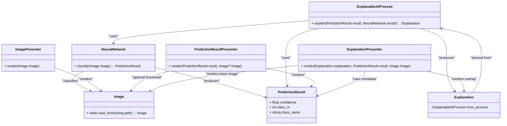

### Relationship Context

```mermaid
classDiagram

%% --------------------
%% Model Layer
%% --------------------
class Image {
    + static load_from(string path): Image
}

class NeuralNetwork {
    + classify(Image image): PredictionResult
}

class PredictionResult {
    + float confidence
    + int class_nr
    + string class_name
}

class ExplainableAIProcess {
    + explain(PredictionResult result, NeuralNetwork model): Explanation
}

class Explanation {
    - ExplainableAIProcess from_process
}

%% --------------------
%% View Layer (Separate Web Pages)
%% --------------------
class ImagePresenter {
    + render(Image image)
}

class PredictionResultPresenter {
    + render(PredictionResult result, Image? image)
}

class ExplanationPresenter {
    + render(Explanation explanation, PredictionResult result, Image image)
}

%% --------------------
%% Relationships (Models)
%% --------------------
NeuralNetwork --> Image : "classifies"
NeuralNetwork --> PredictionResult : "produces"

ExplainableAIProcess --> NeuralNetwork : "uses"
ExplainableAIProcess --> PredictionResult : "uses"
ExplainableAIProcess --> Explanation : "produces"

Explanation --> ExplainableAIProcess : "derived from"

%% --------------------
%% Relationships (Views)
%% --------------------
ImagePresenter --> Image : "renders"

PredictionResultPresenter --> PredictionResult : "renders"
PredictionResultPresenter --> Image : "optional thumbnail"

ExplanationPresenter --> Explanation : "renders overlay"
ExplanationPresenter --> PredictionResult : "uses metadata"
ExplanationPresenter --> Image : "renders base image"

```
