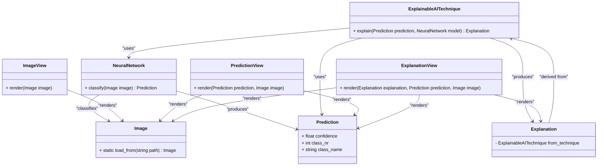
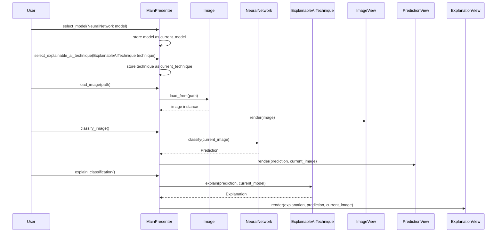

# Static and Dynamic Models

## Architectural Decision: Model-View-Presenter (MVP)

### Context

The Explainable AI (xAI) Teaching App must:

1. Load and visualize images.
2. Classify them using a neural network model.
3. Generate an explanation utilizing a xAI technique.
4. Be maintainable, extensible, and easy to demonstrate live in a classroom.

### Why MVP

The MVP Architecture fulfill these requirements by providing a clear separation between:

- AI + Computation logic (Model)
- Graphic Visualization logic (View)
- User Interaction (Presenter)

Here is important to highlight that MVP architecture was mainly chosen to fulfill the maintainability and extensibility criteria, while maintaining a flexible and lightweight architecture.

#### ✅ Advantages of MVP

- Separation of concerns: Isolates computation, logic, and UI for easier maintenance.
- Extensibility: New models or xAI methods can be added by extending the model layer.
- Testability: Model and presenter can be unit-tested independently from the view.
- Pedagogical clarity: Mirrors conceptual separation between data, processing, and presentation, useful in an educational setting.

#### ⚠️ Disadvantages of MVP

- Slightly more boilerplate code (e.g., additional classes for views and presenters).
- Requires disciplined coordination between components to avoid “fat presenters.”

#### Why not Model-View-Controller (MVC)

MVC could be an easier and lightweight alternative to MVP with less code and less component layers to implement.

Still, the advantages of the MVP overweight the drawbacks, specially regarding the non-functional requirements of manutenability and specially extensibility:

- views renders component only and do not depends on the model (no data-binding/observers)
- presenter (which controls the data flow) does not depend directly on an implemention of a views and do not manipulate view directly (instead, they just depend on an abstraction for listening to user inputs and passing model information to them)
- models do not notifies views for changes

For this reason, new functionalities (for instance for new neural-network models or new explainability techniques) in MVP could be inserted by subclassing/inheriting the existing classes. The same wouldn't be so easy in MVC, since model, view and controllers are more coupled.

### Static Model

#### Class Diagram: Coordination through the Presenter Class

The user interacts with the Presenter, which coordinates the other system classes.

```mermaid
classDiagram

%% --------------------
%% Model Layer
%% --------------------
class Image {
    + static load_from(string path) Image
}

class Prediction {
    + float confidence
    + int class_nr
    + string class_name
}

class NeuralNetwork {
    + classify(Image image) Prediction
}

class ExplainableAITechnique {
    + explain(Prediction prediction, NeuralNetwork for_model) Explanation
}

class Explanation {
    - ExplainableAITechnique from_technique
}

%% --------------------
%% View Layer
%% --------------------
class ImageView {
    + render(Image image)
}

class PredictionView {
    + render(Prediction prediction, Image image)
}

class ExplanationView {
    + render(Explanation explanation, Prediction prediction, Image image)
}

%% --------------------
%% Presenter Layer
%% --------------------
class MainPresenter {
    + load_image(string path)
    + classify_image()
    + explain_classification()
    + select_model(NeuralNetwork model)
    + select_explainable_ai_technique(ExplainableAITechnique technique)
}

%% --------------------
%% Relationships
%% --------------------
MainPresenter --> Image : "loads"
MainPresenter --> NeuralNetwork : "calls for classification"
MainPresenter --> ExplainableAITechnique : "calls for explanation"
MainPresenter --> Prediction : "stores and manages"
MainPresenter --> Explanation : "stores and manages"

MainPresenter --> ImageView : "renders via"
MainPresenter --> PredictionView : "renders via"
MainPresenter --> ExplanationView : "renders via"

```

Notes:

- 1: The main presenter could be in the future broken down into smaller presents
- 2: Specific views like "buttons" are accessory and therefore not shown in the class diagram modelling.

#### Class Diagram: Relationship between Models and Views

##### Views:

1. **ImageView:** renders the image
2. **PredictionView:** renders the image and the prediction
3. **ExplanationView:** renders the image, the prediction and the explanation

##### Models:

1. **Image:** Represents the input image loaded from disk; provides static method `load_from(path)` to import it.
2. **NeuralNetwork:** Performs the classification of an `Image`, producing a `Prediction`.
3. **Prediction:** Holds the classification output (class name, class number, and confidence score).
4. **ExplainableAITechnique:** Uses a `NeuralNetwork` and its `Prediction` to generate an `Explanation` (e.g., via Grad-CAM).
5. **Explanation:** Represents the result of the xAI process, typically (but not only) a visual heatmap derived from the model and prediction.

### Dynamic Model

#### Sequence Diagram: Default Use Case

