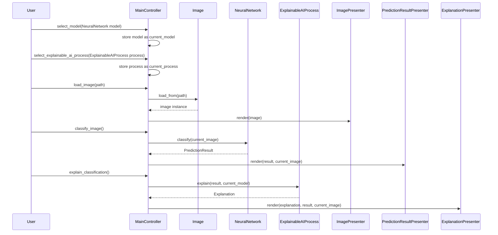

### Sequence Diagram with Main UseCase

```mermaid

sequenceDiagram
    participant User
    participant MainController
    participant Image
    participant NeuralNetwork
    participant ExplainableAIProcess
    participant ImagePresenter
    participant PredictionResultPresenter
    participant ExplanationPresenter

    User->>MainController: select_model(NeuralNetwork model)
    MainController->>MainController: store model as current_model

    User->>MainController: select_explainable_ai_process(ExplainableAIProcess process)
    MainController->>MainController: store process as current_process

    User->>MainController: load_image(path)
    MainController->>Image: load_from(path)
    Image-->>MainController: image instance
    MainController->>ImagePresenter: render(image)

    User->>MainController: classify_image()
    MainController->>NeuralNetwork: classify(current_image)
    NeuralNetwork-->>MainController: PredictionResult
    MainController->>PredictionResultPresenter: render(result, current_image)

    User->>MainController: explain_classification()
    MainController->>ExplainableAIProcess: explain(result, current_model)
    ExplainableAIProcess-->>MainController: Explanation
    MainController->>ExplanationPresenter: render(explanation, result, current_image)
```
