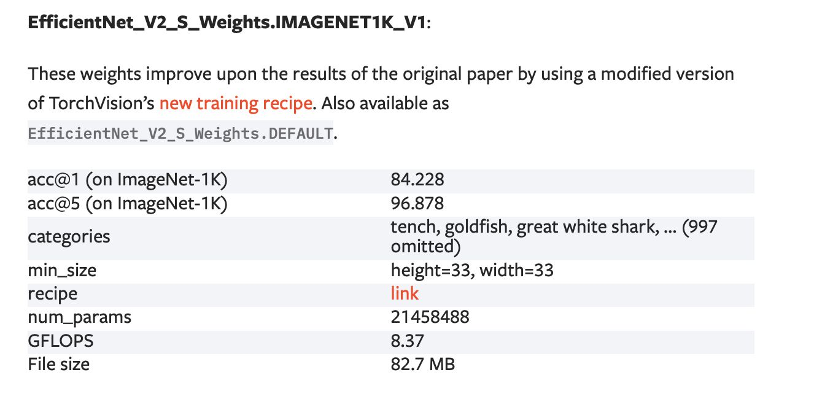
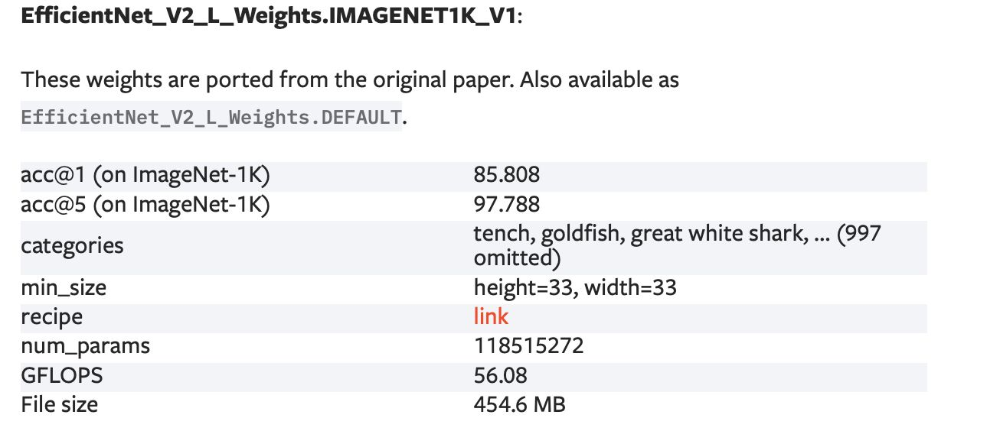

# Models

### PyTorch as Python Library

PyTorch was choosen for implementing our use case, since it seems to be more adequate than TensorFlow/Kera for our requirements:

- it is more flexible (the developer can define exactly what the model does)
- it is more used on research and experimenting (on the flip-side, TensorFlow/Kera seems better for production pipelines)
- it has more tools for xAI

### EfficientNetV2 Abstraction – PyTorch Documentation

Documentation for the EfficientNetV2 abstraction using PyTorch can be found in:
https://docs.pytorch.org/vision/main/models/efficientnetv2.html

(Tipp: For visualizing the model details, click at one of the model builders (s, m or l-size))

Model Card – Efficient Net v2 - S size

Model Card – Efficient Net v2 - L size

### EfficientNetV2 – Prediction Results

While the small model has mistaken the yellow-red apple for an orange, the bigger on predicted it as an Granny Smith (specific type of apple).
